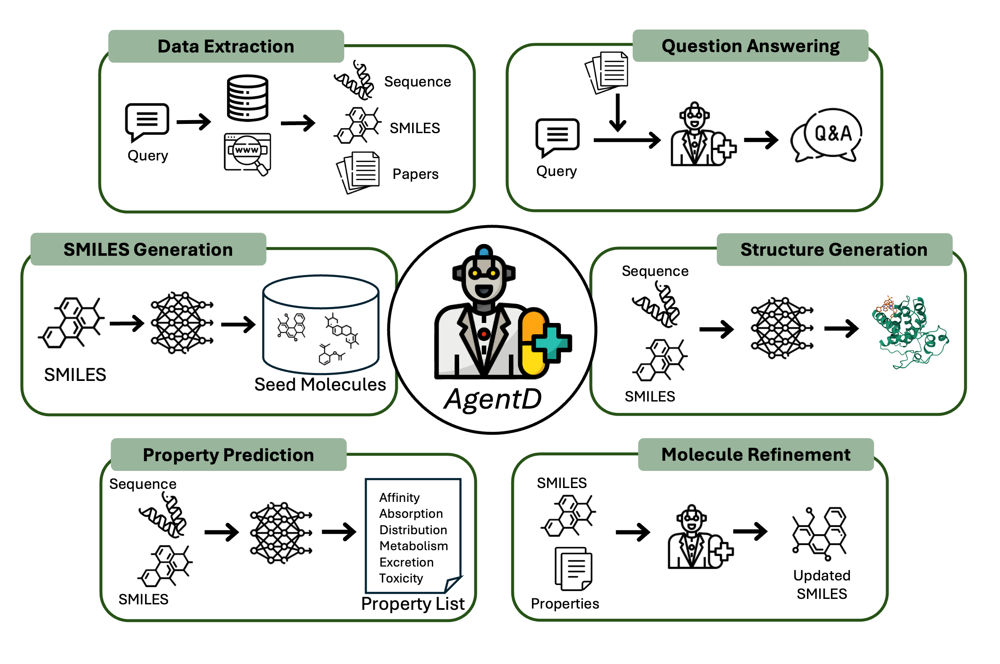

# DiscoveryAgent Documentation

This folder contains practical documentation for running, configuring, and debugging DiscoveryAgent.

## Start Here

- [Getting Started](getting-started.md): environment setup, keys, and first run.
- [Pipeline Configuration](pipeline-configuration.md): complete reference for YAML config keys.
- [Architecture](architecture.md): system flow, module responsibilities, and execution model.
- [MCP Server Reference](mcp-server.md): available server tools and runtime behavior.
- [Run Artifacts](run-artifacts.md): what is written to `runs/<run_id>/` and how to inspect it.
- [Troubleshooting](troubleshooting.md): common errors and actionable fixes.

## Typical Workflow

1. Set API keys and validate `configs/tool_globals.py`.
2. Run `python run_discovery_agent.py --config pipeline_config.yaml`.
3. Monitor execution in `runs/<run_id>/status.json`.
4. Inspect `runs/<run_id>/summary.json` and `runs/<run_id>/boltz_candidates.csv`.
